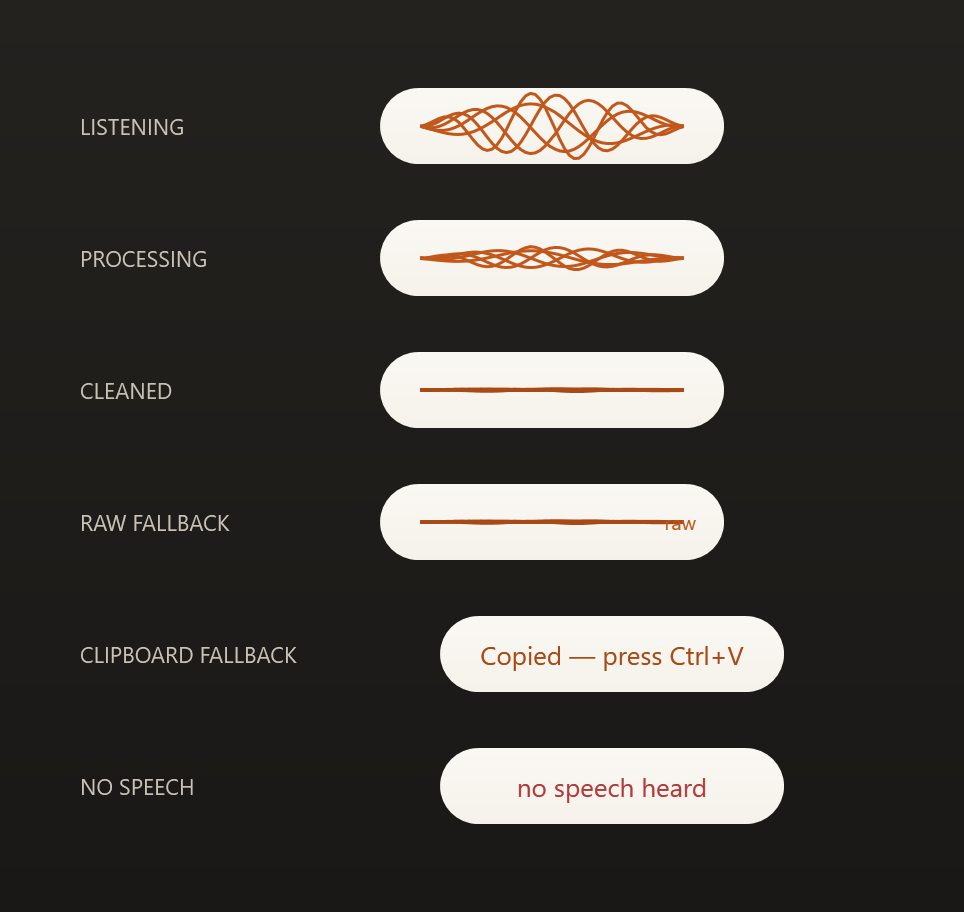

# Outspoken

**Dictation without limits.** A Windows push-to-talk dictation tool: hold a hotkey anywhere, speak, release — your words land at the cursor, cleaned up. Speech-to-text runs **locally** ([Whisper](https://github.com/openai/whisper) via whisper.cpp), so your voice never leaves your machine and there are no word caps. A fast LLM pass tidies the transcript (fillers, false starts, punctuation, homophones) without changing what you said.
<br>
<br>
<p align="center">
  
</p>

Built as a daily driver first — a replacement for a subscription dictation app — and as a portfolio piece: .NET on Windows-on-ARM64 (Snapdragon X Elite), local AI inference, and an AI-assisted build where every commit is human-authored and agent-co-authored.

## How it works

```
hold hotkey ─► listen (local) ─► Whisper transcribe (local) ─► Haiku cleanup ─► text at your cursor
```

1. **Hold** `Ctrl+Win` anywhere and speak. A small overlay appears at the bottom of the screen.
2. **Release.** Local Whisper (`base.en`, quantized) transcribes on-device — your voice never leaves the machine.
3. A fast **LLM cleanup** pass ([`claude-haiku-4-5`](https://www.anthropic.com)) removes filler, resolves self-corrections, fixes punctuation, and disambiguates homophones from context (“sell” vs “cell”).
4. The cleaned text is **injected at your cursor** — in any app.

Hold `+Shift` for **raw mode** (pure Whisper, no cleanup, no network). If the cleanup API is slow or offline, Outspoken delivers the raw transcript instead of blocking — you never lose your words.

## The overlay

The listening pill is the product’s visible signature — a small, calm, paper-like capsule with an amber thread-waveform that tracks your voice. It’s always-on-top, click-through, and never steals focus.



| State | What it shows |
|---|---|
| **Listening** | Amber threads weave to your live mic level. |
| **Processing** | Threads settle into a slow shimmer. |
| **Cleaned** | A brief amber flat-line pulse, then fade. |
| **Raw fallback** | Same, with a small `raw` tag (offline / raw mode). |
| **Clipboard fallback** | “Copied — press Ctrl+V” when the target isn’t editable. |
| **No speech** | A quiet notice — never a dialog box. |

## Principles

- **Private by architecture:** audio is memory-only; the only network call is the text-cleanup request on your own API key. No telemetry, no accounts, no stored dictations.
- **Never lose words:** if injection into the focused app fails, the text stays on the clipboard.
- **Feels instant:** ~2s ceiling from key-release to text-at-cursor (typical cleaned dictation lands in under a second once warm).
- **Bring your own key, prepaid:** cleanup runs on your Anthropic API key (~0.1¢/dictation). With prepaid credit and auto-reload off, spend is hard-capped — and out-of-credit simply degrades to raw transcription.

## Status

🚧 Active build, staged pipeline (spec → ADRs → plan → build). Working today: hotkey → local capture → Whisper transcription → LLM cleanup → text at cursor, with the overlay above. Coming next: audio cues, tray + settings + launch-at-login, then a signed multi-arch (x64 + ARM64) installer.

## Setup (developer build)

Requires the .NET 10 SDK on Windows. Cleanup needs an [Anthropic API key](https://www.anthropic.com) (optional — without one, Outspoken runs in raw mode).

```powershell
dotnet build Outspoken.slnx -c Release

# optional: store your API key (DPAPI-encrypted, never written in plaintext)
$env:ANTHROPIC_API_KEY = "sk-ant-..."
.\src\Outspoken.App\bin\Release\net10.0-windows\win-arm64\Outspoken.App.exe set-key
Remove-Item Env:\ANTHROPIC_API_KEY

# run
.\src\Outspoken.App\bin\Release\net10.0-windows\win-arm64\Outspoken.App.exe
```

The Whisper model (~57 MB) downloads on first run to `%LOCALAPPDATA%\Outspoken\models`.
